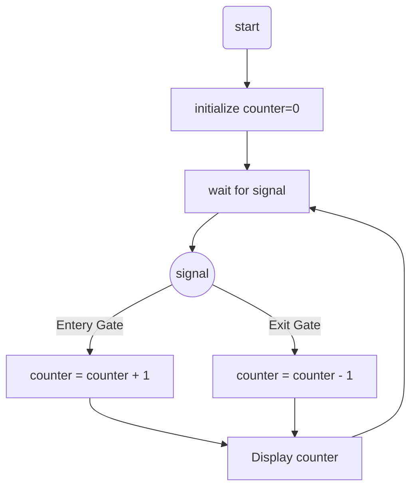
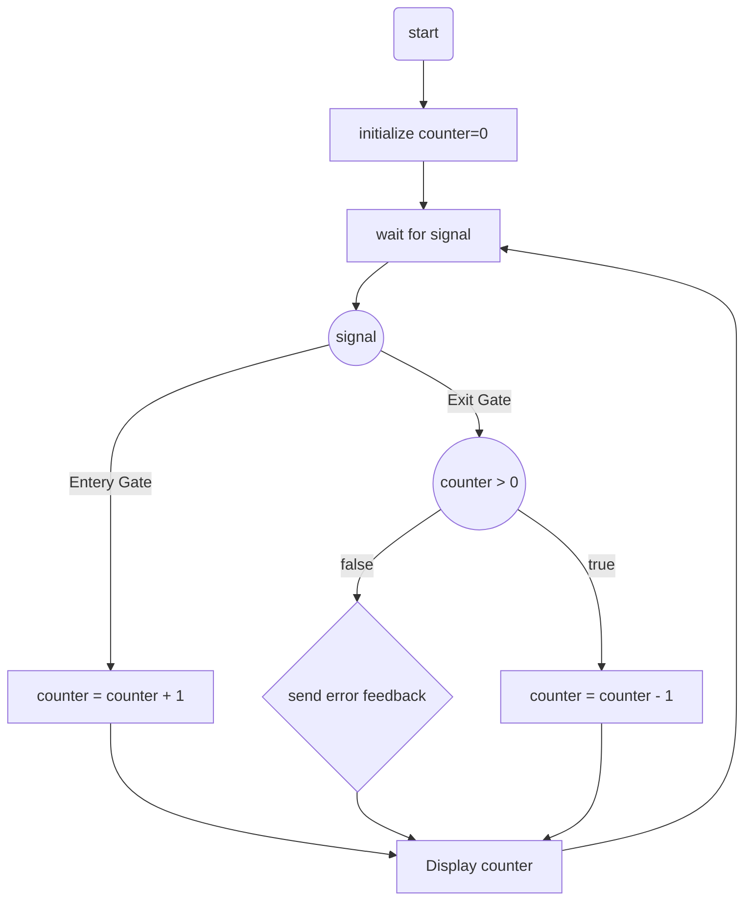

# **SW Candidate Task #5**

  

## Description:

There is parking available with two gates:

- the first gate for cars to enter the parking lot.

- the second gate for the exit of cars

  

Each gate is equipped with sensors to record the entry / exit of cars. Draw a flowchart for an application that determines the current number of cars in the parking lot.

  

## Solution:

- The first solution would be the naive solution:



- After implementation, a critical edge case should be addressed:
  In a real-world scenario, either one of the gate's sensors might be defective, causing a faulty reading.
  If either the entry gate's sensor freezes or the exit gate's sensor mistriggers, the counter might reach a subzero value, which is clearly incorrect. The opposite case is difficult to address programmatically, and won't be covered in this assignment.



The following code is a simple implementation of the system:
```c++
#include <iostream>
using namespace std;

enum Gate {
	ENTRY,
	EXIT
};

int changeCounter(Gate sensor, int count) {
	switch(sensor) {
	    case 0:
	        count++;
	        break;
	    case 1:
	        if (count == 0) {
	            cout << "Error: The Number of Cars Recorded is Bellow Zero, Check Sensors\n";
	            count;
	            break;
	        } else {
	            count--;
	            break;
	        }
	}
	return count;
}

int main() 
{
	int counter {0};
	
	//Test signal from enty gate sensor (should output 1)
	Gate gate = ENTRY;
	counter = changeCounter(gate, counter);
	cout << "After one entry: " << counter <<'\n';
	
	// Test signal for exit gate sensor (Should output 0)
	gate = EXIT;
	counter = changeCounter(gate, counter);
	cout << "After one entry and one exit: " << counter << '\n';
	
	
	// Test signal for second (faulty) exit gate sensor (Should throw an error and output 0)
	counter = changeCounter(gate, counter);
	cout << "After one entry and two exits: " << counter << '\n';
	
}
```
